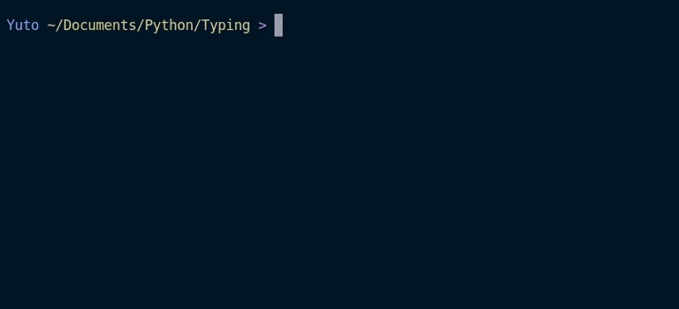

# Typing

Typing is a CLI typing app designed to mesure your typing speed. 




## Installation

Clone the repository on your machine and run `main.py`

```bash
git clone https://github.com/Vincent-vst/Typing.git

cd Typing 

python main.py 
```

## Usage

Once you hit your keyboard, the timer will start.   
Mistakes will appear in red, and once you finish writing, your stats will show off on screen.   
All sentences are randomly chosen in the pangram.txt. So if you want to use your own text, you can edit this file. 
Bonus : If you want to keep track of your progression, you can  : 
```bash
cd assets
sqlite3 statsForNerds
.mode column
select * from logs; 
```

## Contributing

If there is any issue with the above programm, feel free to open a issue so that i can fix it.   
Pull request are welcome too.   

## License
[MIT](https://choosealicense.com/licenses/mit/)
